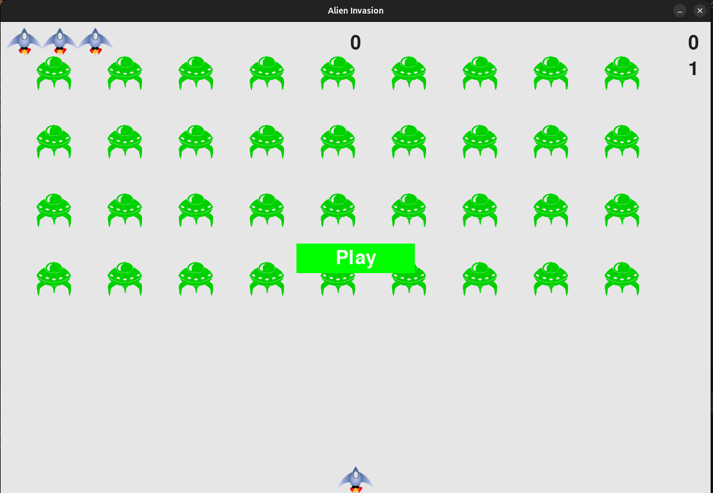

# Alien Invasion

## Description
The Alien Invasion Game is a simple 2D game developed in Python using the Pygame library. 
The game involves shooting down the alien spaceships as they move using a spaceship controlled by the player.

## Features
- Intuitive controls for moving the player's spaceship and shooting lasers
- Increasing difficulty levels as the player progresses through the game
- Score tracking to keep track of the player's performance

## Installation
1. Make sure you have Python installed on your system.
2. Install the Pygame library by running `pip install pygame` in your terminal.
3. Clone the repository to your local machine using `git clone https://github.com/kurocifer/alien_invasion.git`.

## Usage
1. Navigate to the project directory.
2. Run the game by executing `python alien_invasion.py`.
3. Use the left adn right arrow keys to move your spaceship and the space-bar to shoot lasers at the alien spaceships.
4. Survive the alien invasion and aim for a high score!